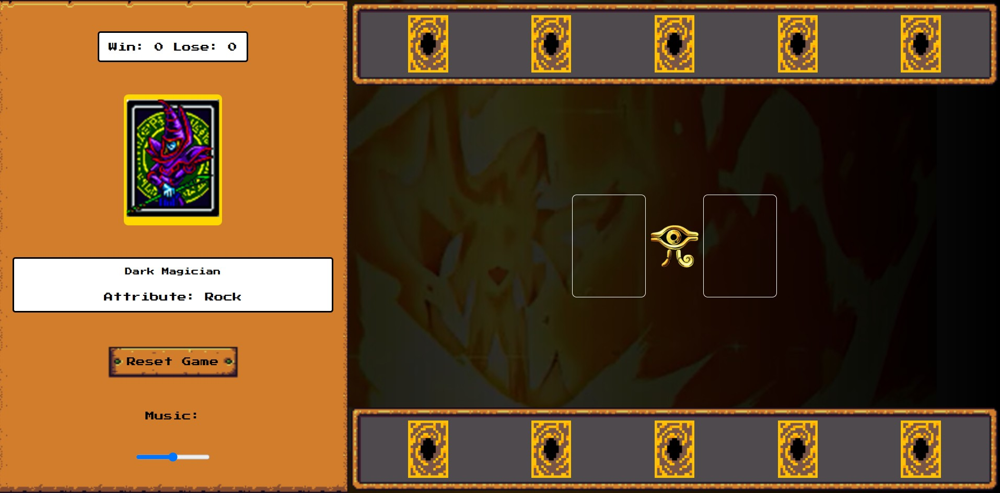
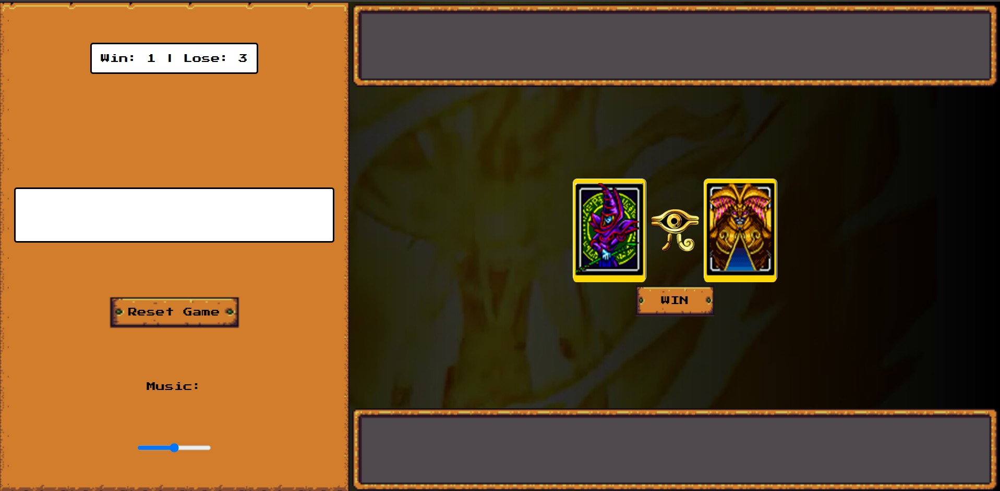
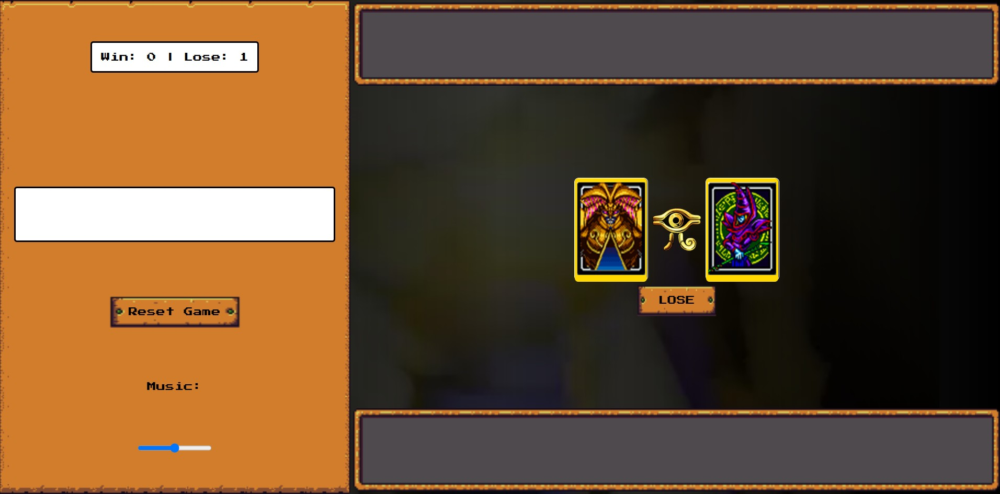

#  Projeto Construindo Yu-Gi-Oh Jo-kem-po Edition
Neste incrível projeto disponibilizado pela DIO para os participantes do Bootcamp Ri Happy - Front-end do Zero, o principal objetivo era aprender mais sobre HTML, CSS e JavaScript na prática e fixar ainda mais diversos conceitos abordados durante o curso. Nesse projeto nosso jogador consegue desafiar um oponente virtual ao um Jo-Ken-Pô no universo de cartas Yu-Gi-Oh.

### 🛠 O que foi necessário para realizar este projeto

O projeto consistiu em configurar e executar um ambiente de desenvolvimento utilizando ferramentas essenciais. Primeiramente, foi necessário instalar o Git para o controle de versões e o Node.js para rodar a aplicação.

Uma IDE (Ambiente de Desenvolvimento Integrado) foi configurada para facilitar a codificação, e, neste caso, optei pelo Visual Studio Code (VSCode). O projeto foi executado via a extensão do VSCode chamada Live Server. Após o desenvolvimento, o código foi versionado e compartilhado em um repositório no GitHub, garantindo o backup e o gerenciamento das versões do projeto.

Abaixo, deixarei alguns links para downloads oficiais de tudo o que foi utilizado para Windows:

```
 Visual Studio Code - https://code.visualstudio.com/
```
```
 GitBash - https://git-scm.com/downloads/win
```
```
 Node.js - https://nodejs.org/pt
```
```
 ID da extensão Live Server - ritwickdey.LiveServer
```
### 🪄 Imagens do Projeto

### Aba principal do Game:


### Ao vencer:


### Ao perder:


